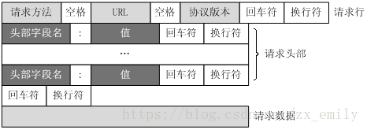
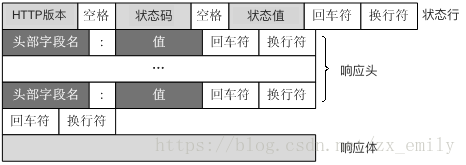

### 服务器功能
1. 模拟处理GET请求访问网页
2. 能处理请求异常
3. 能持续处理请求

### HTTP生命周期
1. read: 读取socket数据流
2. parser: 解析数据流，分析报头，得到客户端的命令语义
3. process: 处理客户端命令，返回结果
4. reponse: 将处理结果打包，增加报头
5. write: 写入socket数据流

### quick start
- clone本项目, 运行测试类Test
- 用浏览器访问 127.0.0.1:8080
- 访问根目录会返回首页，访问其他均会返回404

一定要注意报文格式，头和体之间有一个 "\r\n"
---
HTTP 1.1 请求报文格式

---
HTTP 1.1 响应报文格式

参考：
- [Java 从零开始手撸一个 HTTP 服务器](https://blog.csdn.net/rizero/article/details/111410244)
- Java 并发开发的艺术：一个基于线程池技术的简单服务器
